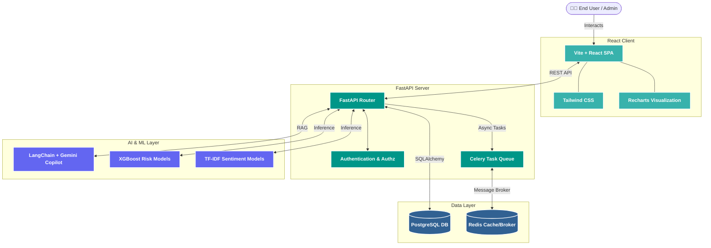

<div align="center">


# 🛒 TrustCart AI 2.0

### Enterprise SaaS Dashboard for E-Commerce Predictive Analytics & Fraud Detection

[](https://react.dev/)
[](https://tailwindcss.com/)
[](https://fastapi.tiangolo.com/)
[](https://www.postgresql.org/)
[](https://www.docker.com/)

*A comprehensive platform to detect fraud, analyze customer reviews for fake activity, predict return risks, and score product/seller trust.*

</div>

<br/>

> [!WARNING]
> **Work in Progress.** This repository is a live, continuously evolving build — **not the final product.** The production-ready enterprise version is kept private. What's here demonstrates the UI/UX foundation and system architecture.

<br/>

## 🎯 Why TrustCart AI?

**The problem.** E-commerce platforms lose billions annually to fraud, chargebacks, and inflated return rates — and fake reviews quietly erode the consumer trust that marketplaces depend on.

**The solution.** TrustCart AI is an enterprise dashboard built for marketplace administrators and store managers. It provides the actionable intelligence needed to monitor transaction health, flag fraudulent sellers, catch suspicious orders, and surface fake reviews — all from a single AI-driven command center that catches risk *before* it hits the bottom line.

<br/>

## 🧠 The AI & ML Stack

TrustCart AI layers three distinct intelligence systems to deliver deep, actionable insight:

| Layer | Technology | What It Does |
|---|---|---|
| 🛡️ **Predictive Risk & Fraud** | XGBoost | Analyzes transaction history, order frequency, and behavioral patterns to score fraud and return probability |
| 🌟 **Review Authenticity** | NLP / TF-IDF | Parses review text for sentiment and linguistic fingerprints of bot-generated or fake content |
| 🤖 **Generative AI Copilot** | LangChain + RAG | Lets users "chat with their data" — plain-language insights, zero SQL required |

<br/>

## 🎓 Project Scope & Skills Demonstrated

**Level: Advanced / Enterprise-Grade**

This isn't a CRUD app — it's a production-shaped, AI-integrated SaaS platform demonstrating:

- 🔹 **Full-Stack Development** — React (Vite) + Tailwind CSS frontend, backed by a high-performance FastAPI service
- 🔹 **Machine Learning Engineering** — Integrating and serving predictive models (XGBoost, NLP) inside a live web ecosystem
- 🔹 **Generative AI** — Context-aware assistants built with LangChain
- 🔹 **System Architecture** — Decoupled microservices with async background processing via Celery + Redis
- 🔹 **Data Engineering** — Robust relational schema design in PostgreSQL
- 🔹 **DevOps** — Fully containerized with Docker & Docker Compose

<br/>

## ✨ Key Features

- 📊 **Enterprise Dashboard** — Animated, real-time charts (Recharts) for revenue, return rates, and fraud attempts
- 🤖 **AI Copilot Dock** — Contextual chat interface for querying your marketplace data in natural language
- 🛡️ **Fraud & Risk Detection** — ML pipelines that surface high-risk sellers and anomalous orders
- 🌟 **Review Intelligence** — Automated "Fake Probability" scoring for customer reviews
- 💼 **Premium UI/UX** — Custom design system with glass-morphism, micro-animations, and smooth transitions

<br/>

## 🏗️ System Architecture



<br/>

## 🚀 Getting Started

### 1. Clone the Repository

```bash
git clone https://github.com/your-username/TrustCart-AI.git
cd TrustCart-AI
```

### 2. Run with Docker (Recommended)

Spins up the entire stack — frontend, backend, database, Redis, and Celery — in one command.

```bash
docker-compose up -d --build
```

| Service | URL |
|---|---|
| 🎨 Frontend Dashboard | `http://localhost:3000` (or `5173` in dev) |
| ⚡ FastAPI Swagger Docs | `http://localhost:8000/docs` |

### 3. Manual Local Setup

<details>
<summary><strong>⚡ Backend (FastAPI)</strong> — requires Python 3.10+</summary>

```bash
cd backend
pip install -r requirements.txt
uvicorn app.main:app --reload
```

Available at `http://localhost:8000`

</details>

<details>
<summary><strong>🎨 Frontend (React + Vite)</strong> — requires Node.js 18+</summary>

```bash
cd frontend
npm install
npm run dev
```

Available at `http://localhost:5173`

</details>
<br/>

## 📸 Screenshots

<div align="center">

| Dashboard Overview | Fraud Detection View |
|:---:|:---:|
|  |  |

| Analytics Charts | Review Intelligence Panel |
|:---:|:---:|
|  |  |

| AI Copilot Dock | Seller Risk Scoring |
|:---:|:---:|
|  |  |

| Order Monitoring | Extra View |
|:---:|:---:|
|  |  |

</div>

<br/>

## 🔮 Roadmap

- [ ] Full backend integration — replace placeholder chart data with live feeds
- [ ] Complete RAG pipeline implementation for the AI Copilot
- [ ] Advanced User Roles & Permissions (RBAC)
- [ ] Exportable PDF & CSV analytics reports

<br/>

<div align="center">

**Built with ❤️ by the TrustCart AI Team**

</div>
