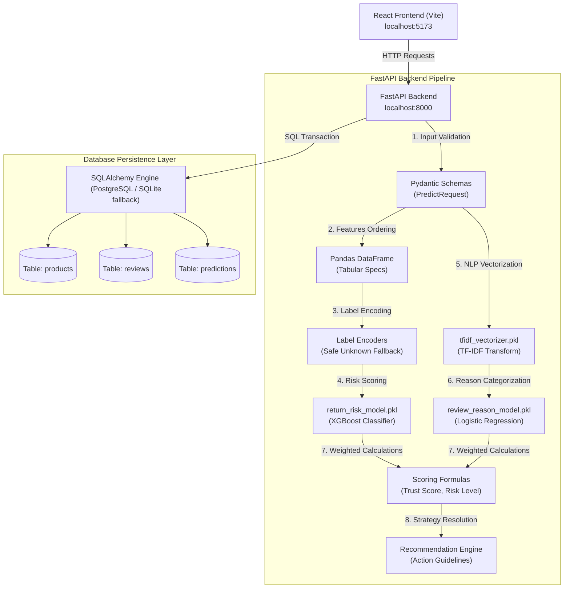

# 🛒 TrustCart AI — Return Risk & Product Trust Scoring

[](https://fastapi.tiangolo.com/)
[](https://react.dev/)
[](https://tailwindcss.com/)
[](https://www.postgresql.org/)
[](https://scikit-learn.org/)
[](https://xgboost.readthedocs.io/)

TrustCart AI is a complete, production-ready, full-stack predictive analytics pipeline for e-commerce platforms. It processes structured order data (price, quantity, shipping, customer age) alongside textual customer reviews to classify return likelihood, evaluate a weighted **Product Trust Score**, categorize primary customer complaints (using NLP), and output actionable refund-reduction recommendations.

---

## 🏗️ System Architecture Flow

The system employs a dual machine learning pipeline (tabular XGBoost classification + NLP TF-IDF text classification) integrated with a persistent database storage layer:



---

## 📂 Project Structure

The project is structured into modular backend (Python) and frontend (React/Vite) codebases:

```
TrustCart/
│
├── README.md                      # Primary project documentation (This file)
│
├── backend/                       # FastAPI backend server
│   ├── main.py                    # Main app configuration, routers, and CORS setup
│   ├── requirements.txt           # Python backend dependencies
│   ├── README.md                  # Backend API guide
│   ├── .env.example               # Environment credentials layout
│   ├── saved_models/              # Kaggle-trained ML models directory
│   │   ├── return_risk_model.pkl
│   │   ├── review_reason_model.pkl
│   │   ├── tfidf_vectorizer.pkl
│   │   ├── label_encoders.pkl
│   │   └── return_model_features.pkl
│   └── app/
│       ├── __init__.py
│       ├── database.py            # SQLAlchemy setup, sessionmaker, and SQLite fallback
│       ├── db_models.py           # SQLAlchemy tables (products, reviews, predictions)
│       ├── schemas.py             # Pydantic schemas (PredictRequest, History, Summary)
│       ├── model_loader.py        # joblib loader and category fallback encoder
│       ├── prediction_service.py  # Inference, formulas math, and data assembly
│       └── recommendation_service.py # Review reason mitigation guidelines mapping
│
└── frontend/                      # React SPA client
    ├── package.json
    ├── vite.config.js
    ├── tailwind.config.js
    ├── postcss.config.js
    ├── index.html
    └── src/
        ├── main.jsx
        ├── App.jsx                # Layout orchestrator
        ├── App.css
        ├── index.css              # Custom scrollbars, glassmorphic styles
        ├── api.js                 # Axios API mapping connection client
        ├── components/
        │   ├── Navbar.jsx         # Header with live connection indicators
        │   ├── StatCard.jsx       # Custom KPI widgets
        │   ├── PredictionForm.jsx # Inputs form with real-time math & loading presets
        │   └── ResultCard.jsx     # Gauge visualizer & circular trust score
        └── pages/
            └── Dashboard.jsx      # Aggregates layout grids and database history tables
```

---

## ⚙️ Setup & Installation

Follow these instructions to configure and run the full-stack system:

### 1. Pre-requisites
Ensure you have **Python 3.10+** and **Node.js 18+** installed on your workstation.

### 2. Place Your ML Model Files
Copy your Kaggle-trained pickle files (.pkl) into the backend models folder:
📁 `TrustCart/backend/saved_models/`
1. `return_risk_model.pkl`
2. `review_reason_model.pkl`
3. `tfidf_vectorizer.pkl`
4. `label_encoders.pkl`
5. `return_model_features.pkl`

### 3. Start Backend Server (FastAPI)
1. Open a terminal and navigate to the `backend/` directory:
   ```bash
   cd backend
   ```
2. Install Python packages:
   ```bash
   pip install -r requirements.txt
   ```
3. *(Optional)* Configure your PostgreSQL connection. Create a `.env` file from the template:
   ```bash
   copy .env.example .env
   ```
   Modify `DATABASE_URL` with your database password/credentials.
   *(Note: If no `.env` is created, the system gracefully falls back to a local file database `sqlite:///./trustcart.db` so you can run the pipeline without configuring PostgreSQL).*
4. Run the Uvicorn server:
   ```bash
   python -m uvicorn main:app --reload
   ```
   API docs will load at: **[http://127.0.0.1:8000/docs](http://127.0.0.1:8000/docs)**

### 4. Start Frontend Client (React)
1. Open a second terminal window and navigate to the `frontend/` directory:
   ```bash
   cd frontend
   ```
2. Install node packages:
   ```bash
   npm install
   ```
3. Run the Vite development server:
   ```bash
   npm run dev
   ```
4. Access the web interface at: **[http://localhost:5173/](http://localhost:5173/)**

---

## 🧠 Core Business Logic & Formulas

### 1. Robust Label Encoder Fallback
E-commerce inputs frequently contain novel values (e.g. unseen categories, custom user locations). To prevent runtime crashes, the categorical parser uses a safe fallback:
$$\text{If } X_{input} \notin \text{Encoder.classes\_} \implies X_{input} \leftarrow \text{Encoder.classes\_}[0]$$
This guarantees the XGBoost predictor receives compatible index formats.

### 2. Return Risk Classification
Risk levels are mapped directly from the predicted positive return probability:
* **High Risk**: $\text{probability} \ge 0.70$
* **Medium Risk**: $0.40 \le \text{probability} < 0.70$
* **Low Risk**: $\text{probability} < 0.40$

### 3. Product Trust Score Equation
The **Product Trust Score** (0-100 index) is calculated using a weighted combination of product, review, seller, return, and complaint-text metrics:

$$\text{Trust Score} = S_{rating} \times 0.30 + S_{reviews} \times 0.20 + S_{seller} \times 0.20 + S_{return} \times 0.20 + S_{complaint} \times 0.10$$

Where:
* **Rating Score ($S_{rating}$)**: $\frac{\text{Rating}}{5} \times 100$
* **Review Volume Score ($S_{reviews}$)**: $\min\left(\frac{\text{Review Count}}{1000}, 1.0\right) \times 100$
* **Seller Score ($S_{seller}$)**: $\frac{\text{Seller Rating}}{5} \times 100$
* **Return Probability Score ($S_{return}$)**: $(1.0 - \text{Return Probability}) \times 100$
* **Complaint Score ($S_{complaint}$)**: $100.0$ if the detected return reason is `"No Issue"`, else $50.0$.

### 4. Action Recommendation Mapping
Depending on the classified complaint text, the recommendation engine selects specific mitigation guides:
* **Size Issue** ➡️ "Improve size chart, add model height/weight reference, and collect size feedback."
* **Quality Issue** ➡️ "Improve supplier quality checks and add clear product material details."
* **Damaged Product** ➡️ "Improve packaging and add pre-shipping quality inspection."
* **Wrong Product** ➡️ "Improve warehouse scanning and product verification before dispatch."
* **Late Delivery** ➡️ "Use faster delivery partners and show realistic delivery dates."
* **Misleading Image** ➡️ "Upload real product photos and mention exact color, size, and material."
* **No Issue** ➡️ "Product looks stable. Continue monitoring reviews and return rate."
