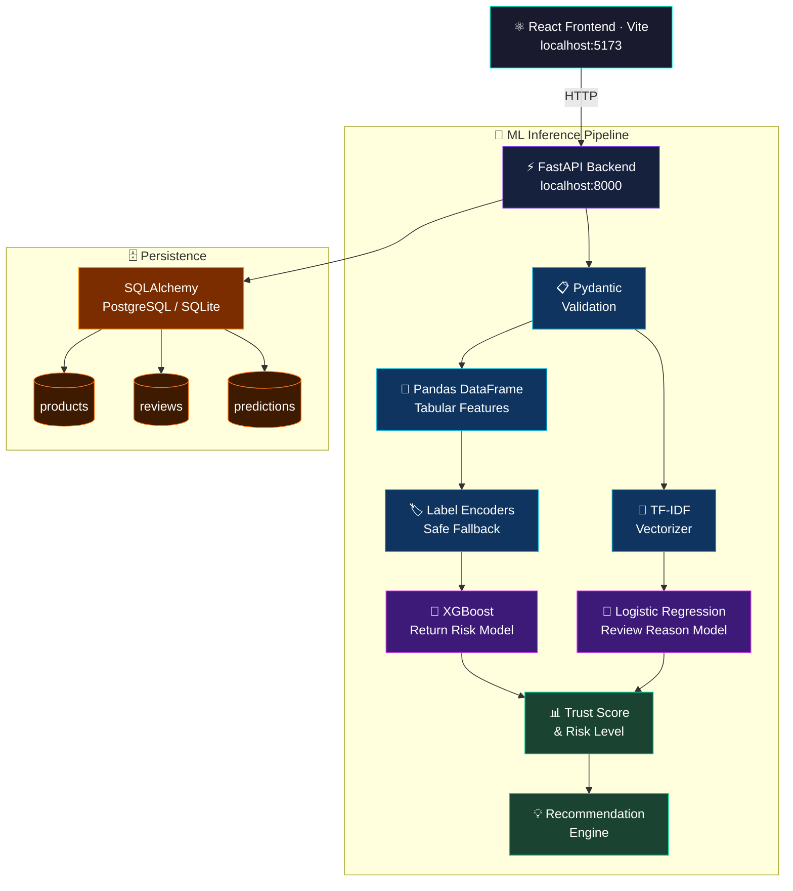

<div align="center">


<br/><br/>

<a href="https://youtu.be/your-demo-video-id">
  
</a>
&nbsp;
<a href="https://trustcart-demo.vercel.app">
  
</a>
&nbsp;
<a href="https://www.kaggle.com/code/krishnayadav456wrsty/trustcart">
  
</a>
&nbsp;
<a href="https://github.com/yourusername/TrustCart">
  
</a>

<br/><br/>


<br/><br/>


&nbsp;

&nbsp;

&nbsp;

&nbsp;


</div>

---

## 🎬 Demo

<div align="center">

<!-- Replace with your actual screen-recording GIF -->


*💡 Record your dashboard with [ScreenToGif](https://www.screentogif.com/) and replace the GIF above*

</div>

---

## ✨ Overview

**TrustCart AI** is a full-stack ML intelligence system for e-commerce platforms that combines **structured order data** with **customer review text** to tackle one of retail's biggest pain points — product returns.

> 🧠 Models trained & exported on Kaggle — **[View the full notebook →](https://www.kaggle.com/code/krishnayadav456wrsty/trustcart)**

E-commerce platforms bleed revenue from returns caused by poor quality, wrong deliveries, misleading images, size problems, and late shipping. TrustCart gives businesses a data-driven edge:

| Capability | Description |
|---|---|
| 🔴 **Return Risk Prediction** | Classifies each order as High / Medium / Low return risk using XGBoost |
| 🏆 **Product Trust Score** | Weighted 0–100 index combining ratings, reviews, seller & complaint signals |
| 💬 **Complaint Detection** | NLP pipeline detects primary return reason from raw review text |
| 💡 **Smart Recommendations** | Auto-generates targeted refund-reduction actions per complaint type |
| 🗄️ **Prediction History** | Stores all results in PostgreSQL with a graceful SQLite fallback |

---

## 🏗️ Architecture

<div align="center">



</div>

---

## 📸 Screenshots

<div align="center"><sub>🖥️ TrustCart AI dashboard in action</sub></div>

<br/>

<table>
  <tr>
    <td align="center">
      
      <sub><b>🏠 Main Dashboard — KPI Cards & Prediction History</b></sub>
    </td>
  </tr>
</table>

<br/>

<table>
  <tr>
    <td align="center" width="50%">
      
      <sub><b>📋 Prediction Form — Data Input</b></sub>
    </td>
    <td align="center" width="50%">
      
      <sub><b>🏆 Result Card — Trust Score & Risk Gauge</b></sub>
    </td>
  </tr>
</table>

<br/>

<table>
  <tr>
    <td align="center">
      
      <sub><b>💡 Analytics — Complaint Classification & Recommendations</b></sub>
    </td>
  </tr>
</table>

---

## 🧪 ML Models & Training

<div align="center">
  <a href="https://www.kaggle.com/code/krishnayadav456wrsty/trustcart">
    
  </a>
</div>

<br/>

Both models were trained, evaluated, and exported as `.pkl` files on **Kaggle** using real e-commerce datasets.

### Datasets

| Dataset | Used For |
|---|---|
| Synthetic E-Commerce Returns Management Dataset | Tabular XGBoost — return risk |
| E-commerce Product Review Data | NLP — return reason detection |

> ⚠️ **Data Leakage Note:** An initial model hit **100% accuracy** because post-return columns (`return_cost`, `profit_loss`, `days_to_return`, `CO2_emissions`, etc.) were included. These were removed to produce a realistic, production-safe model.

### Model 1 — Return Risk (XGBoost)

<div align="center">

| Accuracy | Precision | Recall | F1 Score | ROC-AUC |
|:---:|:---:|:---:|:---:|:---:|
| `70%` | `25%` | `1.73%` | `2.61%` | `58.04%` |

</div>

> Low recall/F1 are expected on heavily imbalanced return datasets. The model outputs a **probability score** used directly for threshold-based risk classification — not hard binary labels.

### Model 2 — Review Reason NLP (TF-IDF + Logistic Regression)

<div align="center">

| Accuracy | Weighted F1 | Macro F1 |
|:---:|:---:|:---:|
| `84.06%` | `83%` | `59%` |

</div>

> Macro F1 is lower due to class imbalance in rare categories (e.g. "Misleading Image"). Weighted F1 reflects strong real-world performance on dominant categories.

### NLP Label Categories

| Label | Detected Patterns |
|---|---|
| 📏 Size Issue | size, fitting, small, large, tight, loose |
| 🔧 Quality Issue | poor quality, cheap material, bad fabric |
| 📦 Damaged Product | broken, cracked, defective, damaged |
| ❌ Wrong Product | wrong item, different product, not what I ordered |
| 🚚 Late Delivery | late, delayed, slow shipping |
| 🖼️ Misleading Image | looks different, color mismatch, not like photo |
| ✅ No Issue | good, great, happy, satisfied |

---

## ⚙️ Setup

### Prerequisites

| Tool | Version |
|---|---|
| 🐍 Python | `3.10+` |
| 🟩 Node.js | `18+` |
| 🐘 PostgreSQL *(optional)* | `14+` |

### Quick Start

**① Clone & add models**

```bash
git clone https://github.com/yourusername/TrustCart.git
cd TrustCart

# Download .pkl files from the Kaggle notebook and place in:
# backend/saved_models/
#   ├── return_risk_model.pkl
#   ├── review_reason_model.pkl
#   ├── tfidf_vectorizer.pkl
#   ├── label_encoders.pkl
#   └── return_model_features.pkl
```

**② Start the backend**

```bash
cd backend
pip install -r requirements.txt

cp .env.example .env          # optional: set your PostgreSQL URL
                               # skip → auto-uses SQLite fallback

python -m uvicorn main:app --reload
# ✅ Swagger docs → http://127.0.0.1:8000/docs
```

**③ Start the frontend**

```bash
cd frontend
npm install
npm run dev
# ✅ Dashboard → http://localhost:5173
```

---

## 📂 Project Structure

```
TrustCart/
├── backend/
│   ├── main.py                       App entry point, routers, CORS
│   ├── requirements.txt
│   ├── .env.example
│   ├── saved_models/                 ← Drop your .pkl files here
│   │   ├── return_risk_model.pkl
│   │   ├── review_reason_model.pkl
│   │   ├── tfidf_vectorizer.pkl
│   │   ├── label_encoders.pkl
│   │   └── return_model_features.pkl
│   └── app/
│       ├── database.py               SQLAlchemy + SQLite fallback
│       ├── db_models.py              Tables: products · reviews · predictions
│       ├── schemas.py                Pydantic schemas
│       ├── model_loader.py           joblib loader + safe encoder fallback
│       ├── prediction_service.py     Inference, scoring formulas
│       └── recommendation_service.py Complaint → action mapping
│
└── frontend/
    ├── package.json
    ├── vite.config.js
    ├── tailwind.config.js
    └── src/
        ├── App.jsx
        ├── api.js                    Axios client
        └── components/
            ├── Navbar.jsx            Live connection indicators
            ├── StatCard.jsx          KPI metric widgets
            ├── PredictionForm.jsx    Input form with live preview
            ├── ResultCard.jsx        Trust score ring + risk gauge
            └── Dashboard.jsx        Grid layout + history table
```

---

## 🧠 Business Logic

<details>
<summary><b>📌 Label Encoder Safe Fallback</b></summary>
<br>

Unseen categories (custom locations, novel inputs) are mapped to a safe default instead of crashing:

$$\text{If } X_{input} \notin \text{Encoder.classes\_} \implies X_{input} \leftarrow \text{Encoder.classes\_}[0]$$

</details>

<details>
<summary><b>🔴 Return Risk Thresholds</b></summary>
<br>

| Risk | Probability | Meaning |
|---|---|---|
| 🔴 High | `≥ 0.70` | Likely return |
| 🟡 Medium | `0.40 – 0.69` | Monitor closely |
| 🟢 Low | `< 0.40` | Stable |

</details>

<details>
<summary><b>🏆 Trust Score Formula</b></summary>
<br>

$$\text{Score} = S_{rating} \times 0.30 + S_{reviews} \times 0.20 + S_{seller} \times 0.20 + S_{return} \times 0.20 + S_{complaint} \times 0.10$$

| Sub-Score | Formula | Weight |
|---|---|:---:|
| ⭐ Rating | $\frac{\text{Rating}}{5} \times 100$ | 30% |
| 📊 Review Volume | $\min\!\left(\frac{\text{Count}}{1000},1\right) \times 100$ | 20% |
| 🏪 Seller | $\frac{\text{Seller Rating}}{5} \times 100$ | 20% |
| 🔄 Return | $(1 - P_{return}) \times 100$ | 20% |
| 💬 Complaint | $100$ if No Issue, else $50$ | 10% |

</details>

<details>
<summary><b>💡 Recommendation Mapping</b></summary>
<br>

| Complaint | Action |
|---|---|
| 📏 Size Issue | Improve size chart, add model height/weight, collect fit feedback |
| 🔧 Quality Issue | Strengthen supplier QC, add material transparency |
| 📦 Damaged Product | Improve packaging, add pre-ship inspection |
| ❌ Wrong Product | Improve warehouse scanning & pre-dispatch verification |
| 🚚 Late Delivery | Partner with faster couriers, show realistic ETAs |
| 🖼️ Misleading Image | Upload real photos with exact color, size, material |
| ✅ No Issue | Continue monitoring — product is performing well |

</details>

---

## 🔌 API Reference

<details>
<summary><b>Endpoints</b></summary>
<br>

| Method | Route | Description |
|---|---|---|
| `POST` | `/predict` | Run full ML inference |
| `GET` | `/history` | Fetch stored predictions |
| `GET` | `/summary` | Dashboard KPI stats |
| `GET` | `/health` | Health check |
| `GET` | `/docs` | Swagger UI |

**Request**
```json
{
  "product_name": "Running Shoes",
  "category": "Footwear",
  "price": 2499,
  "quantity": 1,
  "shipping_type": "Express",
  "customer_age": 28,
  "rating": 3.5,
  "review_count": 412,
  "seller_rating": 4.1,
  "customer_review": "Size runs small and sole came off after a week"
}
```

**Response**
```json
{
  "return_probability": 0.78,
  "risk_level": "High",
  "trust_score": 54.3,
  "return_reason": "Size Issue",
  "recommendation": "Improve size chart, add model height/weight reference..."
}
```

</details>

---

## 🗺️ Roadmap

| | Feature |
|:---:|---|
| ✅ | XGBoost return risk model |
| ✅ | TF-IDF + NLP complaint detection |
| ✅ | Weighted trust score engine |
| ✅ | PostgreSQL / SQLite persistence |
| ✅ | React dashboard — gauge + ring UI |
| ✅ | Kaggle notebook — train & export |
| 🔲 | Docker Compose setup |
| 🔲 | Render + Vercel deployment |
| 🔲 | High-risk order alert webhooks |
| 🔲 | Time-series trend charts |
| 🔲 | JWT authentication |

---

## 🤝 Contributing

1. Fork the repo
2. `git checkout -b feat/your-feature`
3. `git commit -m "Add your feature"`
4. `git push origin feat/your-feature`
5. Open a Pull Request

---

## 📄 License

MIT License — see [`LICENSE`](LICENSE) for details.

---

<div align="center">

*Built by [Krishna Yadav](https://www.kaggle.com/krishnayadav456wrsty) with ❤️ and ☕*

<br/>


&nbsp;


<br/><br/>


</div>
